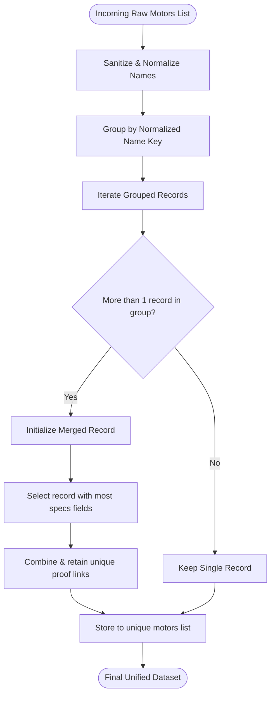

# Features Specification — ThrustVault Scraper

**Document Version**: 1.3.0  

**Target Audience**: Principal Software Architect, Senior Product Manager, Lead Engineer, QA Lead

---

## 1. Multi-Source Search & Pre-Filtering Engine

The core value proposition of ThrustVault is real-time propulsion data aggregation. To prevent massive network overhead, the search engine utilizes target-filtered querying.

### 1.1 Query Tokenization & Smart Matching

Queries are split into alphanumeric tokens to handle spacing variations (e.g. `MN3508 KV380` vs `MN-3508-380KV` vs `MN 3508 380 KV`).

#### Normalization Logic
* Strips punctuation, replaces hyphens with spaces, and converts to lowercase.

* Extracts numerical stator sizes (e.g. `3508`) and KV values (e.g. `380`).

* Rejects generic tokens (like `kv`, `motor`, `t-motor`) to prevent false positives.

* **Match Criteria**: Returns `True` if all core search terms (model prefix and numerical identifiers) exist in the candidate text.

---

### 1.2 Upstream Candidate Pre-Filtering

Before executing detail page fetches (which are expensive), scrapers match the list-view titles and links against the tokenized query:

* **T-Motor Store**: Search returns an average of 12 candidate links (e.g. propellers, motor mounts, screws). Pre-filtering isolates the motor series (e.g. `MN3508`) and skips the remaining 11 detail fetches, saving over 90% of requests.

* **RCBenchmark Database**: Pre-filters the list of 100+ CSV logs by comparing the query keywords directly to the CSV URLs. Only matched files are downloaded.

---

### 1.3 Query Tokenization Matrix & Examples

The table below demonstrates how the smart match tokenizer operates on different query inputs to generate token arrays and decide match status:

| Raw User Query | Extracted Tokens | Target Candidate Name | Smart Match Result |
|:---|:---|:---|:---|
| `"MN3508 KV380"` | `['mn3508', 'kv380', '3508', '380']` | `"T-Motor Navigator MN3508-380KV"` | **MATCH** |
| `"MN3508-380"` | `['mn3508', '3508', '380']` | `"MN3508 Motor 380KV"` | **MATCH** |
| `"Emax 2207"` | `['emax', '2207']` | `"EMAX RS2207 2300KV Motor"` | **MATCH** |
| `"F40 PRO IV 2400"` | `['f40', 'pro', 'iv', '2400']` | `"F40 PRO IV 2400KV Brushless"` | **MATCH** |
| `"MN3508 KV380"` | `['mn3508', 'kv380', '3508', '380']` | `"T-MOTOR P15x5 Carbon Propeller"` | **NO MATCH** |
| `"F40"` | `['f40']` | `"Speedybee F405 V4 Stack"` | **NO MATCH** |

---

## 2. Advanced HTML Table Rowspan Parser

Propulsion specifications and performance tables on manufacturer websites (especially T-Motor) heavily utilize complex HTML tables with `rowspan` and `colspan` attributes (e.g., repeating the stator size cell for multiple KV configurations, or repeating propeller types across different voltages).

Standard HTML parsing libraries parse row-by-row, leading to missing cells in subsequent rows where a prior row has a `rowspan`. ThrustVault implements a custom 2D grid matrix parser in `TMotorScraper` to solve this:

```python
def _parse_html_table(self, table) -> list[list[str]]:
    rows = table.find_all("tr")
    if not rows:
        return []

    grid = {}
    for r_idx, row in enumerate(rows):
        c_idx = 0
        for cell in row.find_all(["td", "th"]):
            # Advance column pointer if index is already claimed by a rowspan from above
            while (r_idx, c_idx) in grid:
                c_idx += 1

            rowspan = int(cell.get("rowspan", 1))
            colspan = int(cell.get("colspan", 1))
            val = cell.get_text(separator=" ", strip=True)

            # Propagate the cell value across its entire rowspan and colspan dimensions
            for r_offset in range(rowspan):
                for c_offset in range(colspan):
                    grid[(r_idx + r_offset, c_idx + c_offset)] = val
            c_idx += colspan

    num_rows = len(rows)
    num_cols = max(c for r, c in grid.keys()) + 1 if grid else 0

    table_data = []
    for r in range(num_rows):
        row_data = [grid.get((r, c), "") for c in range(num_cols)]
        table_data.append(row_data)

    return table_data
```

---

## 3. Real-Time Performance Test Data Processing

The scraper parses empirical bench test tables containing throttle-step curves.

### 3.1 Data Capture Metrics

For each throttle step (typically 50%, 65%, 75%, 85%, 100%), the system extracts:

* **Throttle (%)**: Input signal level.

* **Voltage (V)**: Supply voltage (e.g. 14.8V, 22.2V).

* **Current (A)**: Steady-state current draw.

* **Power (W)**: Electrical power consumed ($P = V \times I$).

* **Thrust (g)**: Mechanical force generated.

* **RPM**: Motor rotation speed.

* **Efficiency (g/W)**: Grams of thrust per electrical watt.

* **Temperature (°C)**: Thermal reading at step duration limit.

---

### 3.2 Dynamic UI Grouping

In the frontend, test data points are grouped dynamically using JS:

* **Group Level 1: Motor model / KV**

* **Group Level 2: Propeller configuration**

* Grouped tables are sorted in ascending order of throttle percentage. This structures the data in a clean, comparable layout.

---

## 4. Groq LLM Spec Normalization & AI Enrichment

When raw web scrapers fail to find specific keys (like "Max Thrust" or "Recommended ESC") due to layout variations, the system uses the **Groq AI Enrichment pipeline**.

### 4.1 Prompt Engineering Strategy

The raw product page text (truncated to the first 4000 characters to conserve context windows) is sent to Groq with a system prompt detailing the target schema.

* **Strict Output Constraints**: The model is instructed to output *only* raw JSON matching the schema. No markdown wrappers, conversational text, or metadata are permitted.

* **Validation**: The backend uses regular expressions to find the JSON boundary `{ ... }` and parses it.

---

### 4.2 Complete LLM Prompt Template

The exact prompt template dispatched to the Groq API model during the enrichment run is specified below:

```text
You are a drone motor database assistant. 
Extract structured motor specifications from the product text below.

Product name: {product_name}

Product text:
"""
{raw_text}
"""

Return ONLY a valid JSON object with these exact fields (use null if unknown):
{
  "motor_name": "full motor model name",
  "company": "manufacturer brand name",
  "max_thrust": "maximum thrust in grams, e.g. 1200g or 1.2kg",
  "kv_rating": "KV rating number, e.g. 2300KV",
  "stator_size": "stator size, e.g. 2207 or 2306",
  "weight_g": "motor weight in grams",
  "shaft_diameter": "shaft diameter in mm",
  "recommended_esc": "recommended ESC model or amperage, e.g. 30A ESC",
  "recommended_propeller": "recommended propeller size, e.g. 5inch 3-blade",
  "battery_config": "battery cell count, e.g. 3S-4S or 6S",
  "max_current": "max current in Amps",
  "description_summary": "1-2 sentence summary of what this motor is best for"
}

Return ONLY the JSON, no explanation, no markdown.
```

---

### 4.3 Multi-Threaded AI Dispatch

To bypass the latency of sequential LLM completions, the enrichment engine parallelizes the API requests. If a search query yields multiple motors that lack manufacturer data, the engine submits up to 10 parallel completions concurrently.

---

## 5. Deduplication & Data Integrity Heuristics

Data collected across different catalogs can contain duplicate entries or formatting discrepancies (e.g., "T-MOTOR MN3508" vs "MN3508" vs "MN 3508").



### Deduplication Engine (`utils/dedup.py`)
* Extracts manufacturer names (T-Motor, Emax, etc.).

* Sanitizes the motor name by stripping branding prefixes, spaces, and casing.

* Keeps the record with the most comprehensive spec list (e.g., prioritizing detail-scraped specs over catalog-scraped summary specs).

* Merges proof links (retaining unique URLs for the motor, ESC, and propeller).

---

## 6. Comprehensive Scraper Matrix Specifications

Below is a highly detailed feature breakdown for each supported data source:

---

### 6.1 T-Motor Official Store Scraper

* **Category Scanning**: Scrapes 10 distinct motor categories including Navigator, Antigravity, U-Efficiency, U-Power, VTOL, Fixed-Wing, and Agricultural drone motors.

* **Search Endpoint**: Targets `store.tmotor.com/search.php?keywords={query}`.

* **Product Discovery Pattern**: Extracts links matching `li.card-list-item h4 a` or `p.trending-item-title a`.

* **Details Extraction Features**:
  * Scrapes specs tables matching strings like `internal resistance`, `idle current`, `motor dimensions`, `weight`, `battery cell count`, `max continuous power`, and `stator diameter`.
  * Scrapes the **Matching Guide** section underneath specs grids to extract official ESC and Propeller recommendations.
  * Scrapes **Proof Links** by dynamically traversing the anchor elements `a[href]` to locate matching product detail pages for the recommended ESCs and Propellers on the store.

---

### 6.2 GetFPV Catalog Scraper

* **Target Segments**: Motors, ESCs, Propellers catalogs.

* **Magento Search Routing**: Hits `getfpv.com/catalogsearch/result/?q={query}`.

* **Cloudflare Mitigation**: Connects via `curl_cffi` using JA3 fingerprinting. Falls back to a headless Playwright Chromium instance with custom timeouts (`PLAYWRIGHT_GOTO_TIMEOUT` at `12s` and `PLAYWRIGHT_SELECTOR_TIMEOUT` at `8s`) to prevent connection hang-ups on Magento rate limit blocks.

* **Selector Configurations**: Parses items via `.product-item-info` and extracts names, prices, and direct catalog URLs.

---

### 6.3 EMAX Official Store Scraper

* **Shopify Catalog Navigation**: Traverses Shopify collections at `/collections/brushless-motors` and `/collections/esc`.

* **Search Endpoint**: Hits `/search?q={query}&type=product`.

* **Pagination Support**: Parses the grid view page-by-page by looking for the next pagination link `a[rel='next']` or `.pagination__next`.

* **Data Fields Captured**: Retrieves name, Shopify-specific product tags, price tags, and direct product detail links.

---

### 6.4 Speedybee Official Catalog Scraper

* **Shopify Collections**: Scrapes Speedybee motor catalogs and ESC pages.

* **Search Endpoint**: Targets `speedybee.com/search?q={query}&type=product`.

* **Selector Configurations**: Selects product links via `.product-item`, `.grid__item`, and `.card__heading` elements, retrieving product titles, prices, and links.

---

### 6.5 RCBenchmark Bench Test Database Scraper

* **Dynamometer Log Integration**: Scrapes public test logs generated by the RCBenchmark series 1520 thrust stand.

* **Index Scraping**: Parses indexing tables at `rcbenchmark.com/pages/series-1520-thrust-stand-dynamometer` and `rcbenchmark.com/pages/database`.

* **CSV Parsing Logic**:
  * Downloads CSV files directly into memory via `io.StringIO`.
  * Uses fuzzy header matching (`csv.DictReader`) to maps columns containing variations of `throttle`, `voltage`, `current`, `power`, `thrust`, `rpm`, `efficiency`, and `temperature`.
  * Normalizes and imports hundreds of empirical test points per CSV file.

---

## 7. JSON Response & Storage Schema Specification

The unified schema for scraped records guarantees uniform output across all integration layers.

---

### 7.1 Motor Specification Schema

Every motor record returned by the API or CLI contains the following fields:

```json
{
  "motor_name": "MN3508 KV380",
  "company": "T-Motor",
  "max_thrust": "1880g",
  "kv_rating": "380KV",
  "stator_size": "3508",
  "weight_g": "82g",
  "shaft_diameter": "4mm",
  "recommended_esc": "Air 20A 3-4S ESC",
  "recommended_propeller": "T-MOTOR P15*5 Prop",
  "battery_config": "3-6S",
  "max_current": "14A",
  "max_power": "310W",
  "internal_resistance": "205mΩ",
  "dimensions": "Φ41.8×26.5mm",
  "link_motor": "https://store.tmotor.com/product/mn3508-motor-navigator-type.html",
  "link_esc": "https://store.tmotor.com/product/air-20a-4s-esc.html",
  "link_propeller": "https://store.tmotor.com/product/polish-carbon-fiber-15x5-prop.html",
  "source": "tmotor_official",
  "description_summary": "High-efficiency multi-rotor motor designed for professional navigation drone payloads."
}
```

---

### 7.2 Performance Test Data Schema

Empirical bench test points are structured as follows:

```json
{
  "source": "tmotor",
  "label": "MN3508 KV380 T-MOTOR 14*4.8CF",
  "source_url": "https://store.tmotor.com/product/mn3508-motor-navigator-type.html",
  "throttle": 50.0,
  "voltage": 14.8,
  "current": 1.3,
  "power": 19.24,
  "thrust_g": 350.0,
  "rpm": 2700.0,
  "efficiency": 18.19,
  "temperature": 43.0
}
```

---

### 7.3 Reference Export Layout (CSV)

The export CSV file utilizes a UTF-8 BOM (`\ufeff`) header for Excel support. Fields are mapped as follows:

```csv
"MOTOR","Company","Max Thrust","Recommended ESC","Recommended Propeller","LINK - Motor ","LINK - ESC","LINK - Propeller"
"MN3508 KV380","T-Motor","1880g","Air 20A 3-4S ESC","T-MOTOR P15*5 Prop","https://store.tmotor.com/product/mn3508-motor-navigator-type.html","https://store.tmotor.com/product/air-20a-4s-esc.html","https://store.tmotor.com/product/polish-carbon-fiber-15x5-prop.html"
```

This guarantees structural alignment when engineers import datasets into mathematical modeling spreadsheets.

---

## 8. Detailed Field Definitions Glossary

The table below lists all database fields and their data types, formats, and structural limits:

| Field Name | Data Type | Regex Format / Unit | Required | Purpose |
|:---|:---|:---|:---|:---|
| `motor_name` | String | `^[A-Z0-9\-\s]+$` | Yes | The official model identifier of the motor (e.g. `MN3508`). |
| `company` | String | Brand | Yes | Manufacturer name (e.g. `T-Motor`, `EMAX`). |
| `max_thrust` | String | `^\d+(g\|kg)$` | No | Maximum thrust generated (e.g. `1880g` or `1.88kg`). |
| `kv_rating` | String | `^\d+KV$` | No | Velocity constant (e.g. `380KV`). |
| `stator_size` | String | `^\d{4}$` | No | Stator diameter and height combined (e.g. `3508`). |
| `weight_g` | String | `^\d+g$` | No | Motor weight excluding cables. |
| `shaft_diameter` | String | `^\d+mm$` | No | Output shaft thickness. |
| `recommended_esc` | String | Name | No | Suggested ESC pairing (e.g. `Air 20A`). |
| `recommended_propeller` | String | Size | No | Suggested propeller pairing (e.g. `15x5`). |
| `battery_config` | String | Cell Count | No | Recommended LiPo cell count (e.g. `3-6S`). |
| `max_current` | String | `^\d+A$` | No | Maximum continuous current rating. |
| `max_power` | String | `^\d+W$` | No | Maximum continuous power rating. |
| `internal_resistance` | String | `^\d+mΩ$` | No | Winding resistance value. |
| `dimensions` | String | Format | No | Motor outer casing dimensions. |
| `link_motor` | String | URL | Yes | Direct proof link to the motor product page. |
| `link_esc` | String | URL | No | Direct proof link to the recommended ESC product page. |
| `link_propeller` | String | URL | No | Direct proof link to the recommended propeller product page. |
| `source` | String | Enum | Yes | Scraper source tag (e.g. `tmotor_official`). |
| `description_summary` | String | Free Text | No | AI-generated summary of target application. |

---

## 9. Rowspan Parsing Implementation Step-by-Step Breakdown

To explain the 2D rowspan grid parsing algorithm, consider the following HTML table:

```html
<table border="1">
  <tr>
    <th rowspan="2">Motor Model</th>
    <th>Stator Height</th>
    <th>Configuration</th>
  </tr>
  <tr>
    <td>8mm</td>
    <td>12N14P</td>
  </tr>
</table>
```

### 9.1 Matrix Cell Indexing Pipeline
The `_parse_html_table` method instantiates an empty coordinate dictionary `grid = {}`. The parser iterates over the rows:

#### Row 0 (`r_idx = 0`)
1. **Cell 0 (`Motor Model`)**: `rowspan = 2`, `colspan = 1`. The value `Motor Model` is written to `grid[(0,0)]` and propagated down to `grid[(1,0)]` because of the `rowspan = 2`.
2. **Cell 1 (`Stator Height`)**: `rowspan = 1`, `colspan = 1`. The value `Stator Height` is written to `grid[(0,1)]`.
3. **Cell 2 (`Configuration`)**: `rowspan = 1`, `colspan = 1`. The value `Configuration` is written to `grid[(0,2)]`.

#### Row 1 (`r_idx = 1`)
1. The loop starts. Column counter `c_idx = 0`.
2. The parser checks if `(1,0)` is already claimed in the `grid` dictionary.
3. `(1,0)` is claimed (it contains `Motor Model` from the previous step). The parser increments `c_idx` to `1`.
4. `(1,1)` is not claimed.
5. **Cell 0 (`8mm`)**: Written to `grid[(1,1)]`.
6. Column pointer increments to `2`.
7. **Cell 1 (`12N14P`)**: Written to `grid[(1,2)]`.

#### Final Matrix Generation
The parser determines the dimensions: `num_rows = 2`, `num_cols = 3`. It constructs a nested list:
```python
[
  ["Motor Model", "Stator Height", "Configuration"],
  ["Motor Model", "8mm", "12N14P"]
]
```
This guarantees that the Stator Model is correctly aligned with the height and configuration specs in the second row, preventing index misalignment.

---

## 10. Normalization & Sanitization Parser Heuristics

Data harvested from HTML pages is highly raw and unformatted. The normalization engine (`parsers/motor_parser.py`) applies several cleaning procedures:

### 10.1 Stator Size Normalization
Stator dimensions are represented in diverse styles:
* `"35x8mm"` ➔ `"3508"`
* `"Φ35 * 8"` ➔ `"3508"`
* `"Stator Diameter 35mm, Stator Height 8mm"` ➔ `"3508"`
The normalizer uses a regular expression to extract the diameter and height numbers:
```python
match = re.search(r'\b(\d{2})\s*(?:x\|xx\|\*\|s\|d)\s*(\d{2})\b', clean_str)
```
If matched, it merges them into a clean 4-digit stator code.

### 10.2 Weight Value Conversion
Weights are converted to clean integer or float values (in grams):
* `"82g"` ➔ `"82g"`
* `"82.5 grams"` ➔ `"82.5g"`
* `"Excluding cables: 82g, Including: 103g"` ➔ Extracts the primary weight (`82g`).

### 10.3 Battery Configuration Standardizer
LiPo cell count ranges are converted to standard cell profiles:
* `"3-6S Lipo"` ➔ `"3-6S"`
* `"3 to 4 Cells"` ➔ `"3-4S"`
* `"12V - 24V"` ➔ `"3-6S"` (Estimated based on voltage range mapping).

---

## 11. Appendix: Complete JSON Response Structure Examples

This appendix displays the full expected JSON responses for both successfully completed queries and edge case scenarios:

### 11.1 Standard Multi-Source Search Payload
```json
{
  "status": "done",
  "query": "MN3508 KV380",
  "motors": [
    {
      "motor_name": "MN3508 KV380",
      "company": "T-Motor",
      "max_thrust": "1880g",
      "kv_rating": "380KV",
      "stator_size": "3508",
      "weight_g": "82g",
      "shaft_diameter": "4mm",
      "recommended_esc": "Air 20A 3-4S ESC",
      "recommended_propeller": "T-MOTOR P15*5 Prop",
      "battery_config": "3-6S",
      "max_current": "14A",
      "max_power": "310W",
      "internal_resistance": "205mΩ",
      "dimensions": "Φ41.8×26.5mm",
      "link_motor": "https://store.tmotor.com/product/mn3508-motor-navigator-type.html",
      "link_esc": "https://store.tmotor.com/product/air-20a-4s-esc.html",
      "link_propeller": "https://store.tmotor.com/product/polish-carbon-fiber-15x5-prop.html",
      "source": "tmotor_official",
      "description_summary": "High-efficiency multi-rotor motor designed for professional navigation drone payloads."
    }
  ],
  "performance": [
    {
      "source": "tmotor",
      "label": "MN3508 KV380 T-MOTOR 14*4.8CF",
      "source_url": "https://store.tmotor.com/product/mn3508-motor-navigator-type.html",
      "throttle": 50.0,
      "voltage": 14.8,
      "current": 1.3,
      "power": 19.24,
      "thrust_g": 350.0,
      "rpm": 2700.0,
      "efficiency": 18.19,
      "temperature": 43.0
    }
  ]
}
```

### 11.2 Empty Scrape Result Payload
```json
{
  "status": "done",
  "query": "INVALID_QUERY_THAT_RETURNS_NOTHING",
  "motors": [],
  "performance": []
}
```
This structured format ensures API client clients can parse search outcomes gracefully without key errors.

