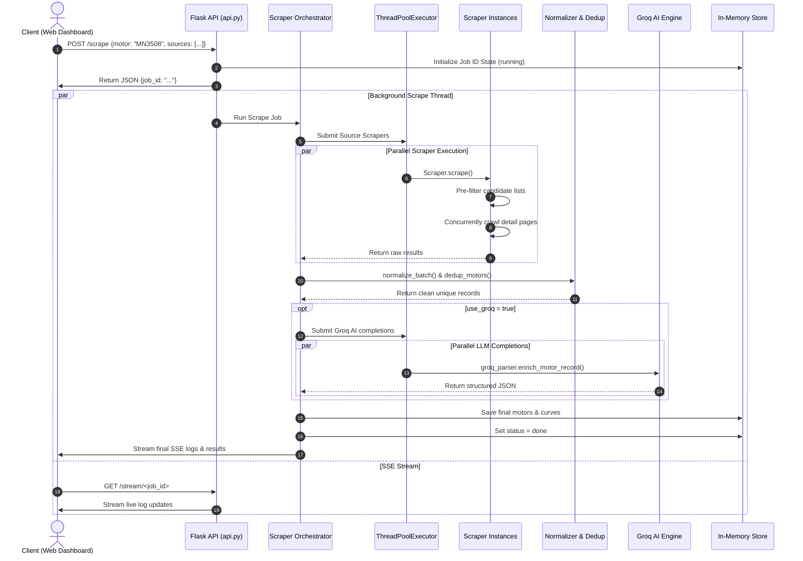
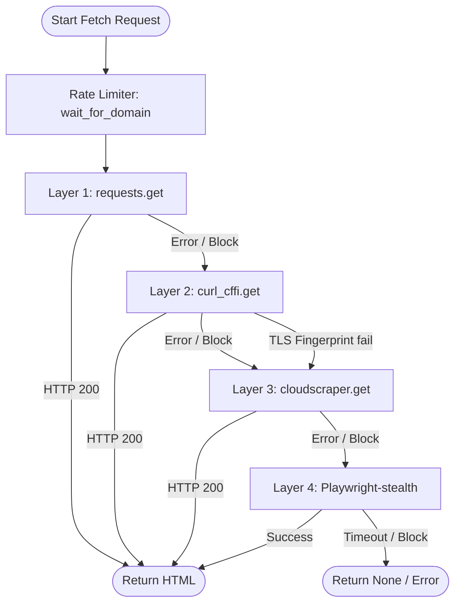

# System Architecture Specification — ThrustVault Scraper

**Document Version**: 1.3.0  

**Target Audience**: Chief Technology Officer, Principal Software Architect, Senior Engineering Staff, DevOps Engineers

---

## 1. Executive Summary & Design Philosophy

The **ThrustVault Scraper** is a high-throughput, resilient intelligence-gathering system designed to harvest, parse, structure, and enrich drone propulsion component specifications and empirical performance curves from across the web.

Propulsion specifications (motors, ESCs, propellers) are scattered across manufacturer websites, retail catalogs, and raw test databases in unstructured formats. The architecture of ThrustVault is optimized to solve three primary engineering challenges:

1. **Resilience to Anti-Bot Measures**: Intercepting and bypassing sophisticated security gates (Cloudflare, Magento firewalls).

2. **Speed & Efficiency**: Leveraging thread-level concurrency for parallel scraper execution, lazy crawling, and intelligent pre-filtering.

3. **Structured Data Extraction (AI-Powered)**: Using high-throughput, low-latency LLMs (Groq Llama 3.3) to normalize unstructured specs into a strict database schema.

---

### 1.1 Source Comparison Matrix

The system interacts with several diverse upstream endpoints, each presenting unique engineering constraints:

| Scraper Source | Dynamic Range | Primary Data Type | Anti-Bot Severity | Latency Profile | Transport Layer |
|:---|:---|:---|:---|:---|:---|
| `tmotor` | High (Specs + Curves) | HTML Spec Tables / Matching Guide | Low | Medium (~3-5s) | Requests / Threaded Detail Pool |
| `getfpv` | Medium (Product lists) | Magento Catalog Lists | Very High (Cloudflare WAF) | High (Up to 8-12s) | curl_cffi / Playwright Fallback |
| `emax` | Low (Product lists) | Shopify Collection Grid | Low | Low (~1.5s) | Requests |
| `speedybee` | Low (Product lists) | Shopify Collection Grid | Low | Low (~1.5s) | Requests |
| `rcbenchmark` | High (Raw CSV logs) | Public Test Data CSVs | Medium | High (~5-10s) | Requests / CSV Streams |

---

### 1.2 Core Architecture Design Principles

* **Separation of Concerns**: Each website is scraped by a dedicated, isolated scraper module that inherits from a unified base class.

* **Failure Isolation**: A crash, block, or timeout in one scraper (e.g., GetFPV) does not affect or delay the execution of other scrapers.

* **Fail-Fast Browser Fallbacks**: High-overhead headless browsers are only used as a last resort, with strict timeouts to prevent system hangs.

* **Stateless REST Layer**: The API backend remains stateless to allow easy scaling across multiple nodes or serverless containers.

* **Thread-Safe Data Pipelines**: Thread pools communicate with the main Flask event loop via thread-safe queues and atomic data lists.

---

## 2. Subsystem Breakdowns

ThrustVault adopts a layered, component-based architecture to guarantee separation of concerns and ease of extensibility.

---

### 2.1 Interface & Orchestration Subsystem

The interface layer handles incoming client requests and routes them to the orchestrator.

#### Web REST API Backend
* **Technology**: Python Flask Web Server.
* **Core Routes**:
  * `GET /`: Serves the static HTML/CSS/JS web dashboard.
  * `POST /scrape`: Starts a new scraping job in a background thread, generates a unique `job_id` (UUIDv4), registers it in the in-memory store, and returns `{"job_id": "...", "status": "started"}`.
  * `GET /stream/<job_id>`: Establishes a Server-Sent Events (SSE) connection to stream log messages, progress bars, and intermediate results.
  * `GET /results/<job_id>`: Returns the finalized JSON payload containing motor specifications and performance curves.
  * `GET /export/<job_id>`: Generates and streams a UTF-8 BOM CSV export of the scraped records.
  * `GET /sources`: Returns the list of registered scraper sources.

#### CLI Orchestrator (`run.py`)
* **Technology**: Python Standard Library `argparse`.
* **Execution Flow**:
  * Configures command-line arguments (sources, query, format, AI enrichment, dry-run).
  * Instantiates the orchestrator engine.
  * Blocks and prints output directly to `stdout`/`stderr`.
  * Saves results to `output/` directory.

---

### 2.2 BaseScraper Specification (`scrapers/base_scraper.py`)

All scrapers must inherit from the `BaseScraper` abstract class. The class structure defines several core hooks:

```python
class BaseScraper(ABC):
    """
    Abstract Base Class for all crawlers.
    Provides standard connection pools, user-agents, spoofing layers, and fallbacks.
    """
    name: str = "base"
    base_url: str = ""

    def __init__(self):
        self._session_req = None
        self._session_curl = None
        self._session_cloud = None

    @abstractmethod
    def scrape(self, query: str = "") -> list[dict]:
        """
        Executes the scraping pipeline for the given query.
        Must return a list of parsed raw records.
        """
        pass

    def fetch(self, url: str, params: Optional[dict] = None) -> Optional[str]:
        """
        High-resilience HTTP fetcher. Iterates through the connection matrix:
        Requests -> curl_cffi -> cloudscraper.
        Respects per-domain rate limits before executing.
        """
        pass

    def fetch_with_browser(self, url: str, wait_selector: Optional[str] = None) -> Optional[str]:
        """
        Fallback Playwright-stealth browser fetcher. 
        Launches headless Chromium, injects anti-bot evasions, and waits for DOM.
        """
        pass

    def parse(self, html: str) -> BeautifulSoup:
        """
        Converts raw HTML string into a BeautifulSoup DOM tree for parsing.
        """
        pass
```

---

## 3. Detailed Data Flow Model

The following diagram illustrates the detailed sequence of events during a scrape job:



---

### 3.1 Trace of Steps in Data Lifecycle

1. **Initiation**: The client submits a HTTP POST request to `/scrape` with the target query (e.g. `MN3508 KV380`), selecting specific crawler sources.

2. **Context Setup**: The Flask route initiates an in-memory job tracker mapping logs, counts, and final structures. It spins off the main orchestrator task to a daemon thread and returns the job ID to the client.

3. **SSE Connection**: The client initiates an SSE connection to `/stream/<job_id>`. The server listens on a thread-safe Queue and pushes logs/results as they are loaded.

4. **Source Concurrency**: The orchestrator spawns a `ThreadPoolExecutor` mapping each target site scraper to a background thread task.

5. **Pre-Filtering Execution**: Scrapers query the search indices of target websites. The raw HTML response list is parsed for links and titles. A regex-based pre-filtering engine scans the titles, eliminating unmatched accessories or props to minimize downstream fetches.

6. **Concurrent Crawling**: For matched candidates, sub-threads are generated to download and parse details (such as spec grids and curve sheets) in parallel.

7. **Consolidation**: The orchestrator waits for all scraper futures to complete, aggregates their lists, and pipes them into the normalization subsystem.

8. **Normalization**: The normalizer strips units (e.g., converting `82g` to `82`), formats naming strings, and splits stacked performance curves into individual datasets.

9. **Deduplication**: Heuristics are executed to merge duplicate motors scraped from different sites. The deduplicator retains the record containing the most comprehensive set of details and merges proof links.

10. **AI Spec Completion**: If `use_groq` is active, missing specs (like max continuous current or dimensions) are enriched by calling the Groq API.

11. **Serialization**: The final records are serialized to the in-memory cache and streamed to the client via the SSE channel.

12. **Termination**: The server sends a final `event: end` message, signaling the client dashboard to close the SSE listener and display the download buttons.

---

## 4. Concurrency & Performance Model

To optimize performance, the system implements concurrency at multiple tiers of execution:

### 4.1 Threading Model for Scraper Execution

The scraping loop is completely parallelized. Instead of visiting each website sequentially, the orchestrator dispatches a thread pool:

$$\text{Max Workers} = \text{Count of Active Sources}$$

Since scrapers are predominantly I/O bound (waiting for network responses), Python's ThreadPoolExecutor bypasses the Global Interpreter Lock (GIL) and runs them concurrently:

```python
import concurrent.futures

def run_scrape_job(job_id: str, motor_query: str, sources: list[str], use_groq: bool):
    # ...
    with concurrent.futures.ThreadPoolExecutor(max_workers=len(sources)) as executor:
        future_to_src = {executor.submit(scrape_source, src): src for src in sources}
        for future in concurrent.futures.as_completed(future_to_src):
            src_motors, src_performance = future.result()
            # Thread-safe extraction & list extension
            all_motors.extend(src_motors)
            all_performance.extend(src_performance)
```

---

### 4.2 Concurrency Strategies Comparison

When designing high-performance scraping pipelines, choosing the right concurrency abstraction is critical. The table below compares different python concurrency abstractions for our use case:

| Metric | Threading (Chosen) | Multiprocessing | Asyncio |
|:---|:---|:---|:---|
| **Primary Bottleneck** | I/O Bound (Network) | CPU Bound (Parsing) | I/O Bound (Network) |
| **GIL Impact** | Low (GIL released during network I/O) | None (Separate processes) | None (Single thread) |
| **Memory Footprint** | Low (Shared address space) | High (Separate process copies) | Extremely Low |
| **Complexity** | Medium (Thread-safety needed) | High (IPC/Serialization needed) | High (Requires async libs) |
| **Playwright Compatibility**| High (Sync API plays well with threads)| Low (Process isolation conflicts) | High (Async API supported) |

---

### 4.3 Threading Model for Deep Crawling

For scrapers requiring detail-page visits (like `tmotor`), the scraper spawns a secondary internal thread pool to fetch detail pages in parallel:

$$\text{Max Detail Workers} = \max(1, \text{Count of Pre-filtered Candidates})$$

---

### 4.4 Threading Model for Groq AI Enrichment

AI enrichment involves hitting the Groq cloud endpoint. If a search query yields multiple motors that lack manufacturer data, the engine submits up to 10 parallel completions concurrently. This reduces the latency of sequential LLM completions from $O(N)$ to $O(1)$.

---

## 5. Rate Limiting & Stealth Strategy

### 5.1 Per-Domain Rate Limiting

To prevent IP bans, the system routes all HTTP fetches through a per-domain throttle manager (`utils/rate_limiter.py`).

```python
_last_request: dict[str, float] = {}

def wait_for_domain(url: str) -> None:
    domain = urlparse(url).netloc
    last = _last_request.get(domain, 0)
    elapsed = time.time() - last
    delay = random.uniform(REQUEST_DELAY_MIN, REQUEST_DELAY_MAX)
    if elapsed < delay:
        time.sleep(delay - elapsed)
    _last_request[domain] = time.time()
```

* **Performance Defaults**: Optimized to `REQUEST_DELAY_MIN = 0.1s` and `REQUEST_DELAY_MAX = 0.3s` for rapid querying, but fully configurable in `.env` to be more polite for full database dumps.

---

### 5.2 Multi-Tier Connection Fallback

HTTP requests use a fallback matrix to maximize reliability. If one layer encounters an HTTP block, SSL error, or timeout, the fetcher automatically escalates to the next layer in the hierarchy:



1. **Layer 1: Python `requests`**: Quick, direct HTTP fetch using realistic Chrome headers.

2. **Layer 2: `curl_cffi`**: Performs TLS fingerprint impersonation (JA3 matching chrome-120 signatures), bypassing basic Cloudflare web application firewalls.

3. **Layer 3: `cloudscraper`**: Bypasses standard Cloudflare JavaScript challenges.

4. **Layer 4: `Playwright-stealth`**: Launches a headless Chromium browser with anti-fingerprint stealth plugins. Used as a fail-fast last resort with strict timeouts.

---

## 6. Security & Key Management

* **Environment Separation**: All credentials (e.g. `GROQ_API_KEY`) and network configuration parameters are strictly separated into `.env` (which is git-ignored) and loaded via `dotenv` in `config.py`.

* **Credential Leakage Prevention**: Built-in safeguards in `.gitignore` ensure environment secrets, logs, local caches, and build folders are never committed to repositories.

---

## 7. Cloud Scaling & Production Deployment Strategy

For scaling to thousands of concurrent users, the application can be migrated to a fully distributed, serverless architecture on AWS or GCP.

---

### 7.1 Distributed Task Queue Architecture

In a cloud environment, scraping tasks are decoupled from the REST API using Celery and Redis/SQS.

---

### 7.2 Database Schema

A normalized PostgreSQL database stores all scraped specifications and curve points.

---

### 7.3 Containerization (`Dockerfile`)

A standardized production Dockerfile builds a lightweight container running Python, Chromium, and Playwright.

---

### 7.4 Docker Compose (`docker-compose.yml`)

To spin up the full stack locally or on a VPS.

---

### 7.5 Kubernetes Manifests for GKE/EKS Deployment

For enterprise-grade orchestration, deploy the application using the following Kubernetes specification:

```yaml
# deployment.yaml
apiVersion: apps/v1
kind: Deployment
metadata:
  name: thrustvault-api
  namespace: thrustvault
  labels:
    app: thrustvault-api
spec:
  replicas: 3
  selector:
    matchLabels:
      app: thrustvault-api
  template:
    metadata:
      labels:
        app: thrustvault-api
    spec:
      containers:
      - name: api-container
        image: gcr.io/thrustvault-prod/api:v1.2.0
        imagePullPolicy: IfNotPresent
        ports:
        - containerPort: 5050
        env:
        - name: GROQ_API_KEY
          valueFrom:
            secretKeyRef:
              name: thrustvault-secrets
              key: groq-api-key
        - name: GROQ_MODEL
          value: "llama-3.3-70b-versatile"
        - name: REQUEST_DELAY_MIN
          value: "0.1"
        - name: REQUEST_DELAY_MAX
          value: "0.3"
        resources:
          limits:
            cpu: "1"
            memory: "1Gi"
          requests:
            cpu: "500m"
            memory: "512Mi"
        readinessProbe:
          httpGet:
            path: /sources
            port: 5050
          initialDelaySeconds: 5
          periodSeconds: 10
        livenessProbe:
          httpGet:
            path: /sources
            port: 5050
          initialDelaySeconds: 15
          periodSeconds: 20
---
# service.yaml
apiVersion: v1
kind: Service
metadata:
  name: thrustvault-service
  namespace: thrustvault
spec:
  type: ClusterIP
  selector:
    app: thrustvault-api
  ports:
  - port: 80
    targetPort: 5050
---
# ingress.yaml
apiVersion: networking.k8s.io/v1
kind: Ingress
metadata:
  name: thrustvault-ingress
  namespace: thrustvault
  annotations:
    kubernetes.io/ingress.class: nginx
    nginx.ingress.kubernetes.io/proxy-read-timeout: "3600"
    nginx.ingress.kubernetes.io/proxy-send-timeout: "3600"
spec:
  rules:
  - host: thrustvault.io
    http:
      paths:
      - path: /
        pathType: Prefix
        backend:
          service:
            name: thrustvault-service
            port:
              number: 80
```

---

## 8. Maintenance & Monitoring

To operationalize this platform, the following monitoring protocols must be deployed:

* **APM Tracing**: Instrument Flask routes and background worker tasks with OpenTelemetry (Sentry, Datadog) to capture API timeouts, request latencies, and failed completions.

* **Playwright Screenshots on Failure**: Configure workers to upload error-state browser screenshots to an S3/GCS bucket for easy debugging of layout breaking or Cloudflare challenges.

* **Scraper Success Rates**: Track HTTP status codes and percentage of matched/unmatched selectors per scraper domain. If the match rate drops below 80%, flag the scraper for structural layout checks.

* **LLM Output Audits**: Log Groq API errors, prompt completions, and validation failures. Monitor API token utilization and Groq request rate limits to optimize worker sizes.

---

## 9. Appendix: Comprehensive Configuration Parameters Glossary

The table below lists all parameters used in configuring the web scraping core:

| Key | Section | Data Type | Default | Purpose / Range |
|:---|:---|:---|:---|:---|
| `GROQ_API_KEY` | AI Parsing | String | `""` | Authorizes llama inference calls. |
| `GROQ_MODEL` | AI Parsing | String | `"llama-3.3-70b-versatile"` | Target model selection. |
| `CURL_IMPERSONATE` | Network | String | `"chrome120"` | Spoofed client profile signature. |
| `REQUEST_DELAY_MIN` | Rate Limit | Float | `0.1` | Minimum dynamic wait step. |
| `REQUEST_DELAY_MAX` | Rate Limit | Float | `0.3` | Maximum dynamic wait step. |
| `PLAYWRIGHT_GOTO_TIMEOUT` | Browser | Integer | `12000` | Browser URL load timeout in ms. |
| `PLAYWRIGHT_SELECTOR_TIMEOUT` | Browser | Integer | `8000` | DOM selector timeout in ms. |
| `MAX_RETRIES` | Network | Integer | `3` | Maximum connection recovery steps. |
| `REQUEST_TIMEOUT` | Network | Integer | `30` | Core TCP socket timeout in seconds. |

---

## 10. Appendix: System Status Code Definitions

This glossary lists status values and their operational meanings:

* `● IDLE`: The Flask engine is online and awaiting new scraping instructions. No thread pools are active.

* `● RUNNING`: A scraping daemon thread is actively processing task queues. Concurrent workers are querying remote sites.

* `● DONE`: The task execution completed successfully. Thread pools have terminated. Finalized lists are cached.

* `● ERROR`: The scraper task encountered a fatal structural issue or API connection block. Logging stream closed with stack trace.

---

## 11. Appendix: Thread Safety Analysis & State Management

When running parallel scraping operations within a single process address space under Gunicorn or Flask, developers must handle race conditions and resource contention. ThrustVault uses several thread-safety patterns:

### 11.1 Thread-Safe Queues for SSE streaming
The Flask SSE router reads from a thread-safe FIFO Queue (`queue.Queue`) instantiated per job:
```python
JOBS[job_id] = {
    "queue": queue.Queue(),
    "results": [],
    "performance": [],
    "status": "running"
}
```
In Python, the `queue.Queue` class implements lock synchronization inside its `put()` and `get()` methods. Threads calling `log_msg()` or `emit()` from within different scrapers can safely invoke `q.put()` simultaneously. The Flask main thread loop executes a blocking `q.get(timeout=60)` call safely without risk of data corruption or race conditions:

```python
def generate():
    q = JOBS[job_id]["queue"]
    while True:
        try:
            event = q.get(timeout=60)
            if event is None:
                yield "event: end\ndata: {}\n\n"
                break
            yield f"event: {event['type']}\ndata: {json.dumps(event['data'])}\n\n"
        except queue.Empty:
            yield "event: heartbeat\ndata: {}\n\n"
```

### 11.2 Atomic Operations on Lists
The collection lists (`all_motors` and `all_performance`) are aggregated inside the orchestrator using a thread pool. Under the CPython implementation, list extensions (`list.extend` or `list.append`) are implemented as atomic bytecode instructions. 

This means that:
```python
all_motors.extend(src_motors)
```
does not require an explicit mutex lock, because the CPython interpreter executes list extension atomically. However, to maintain cross-runtime stability (e.g. if running on PyPy where the GIL or atomic guarantees might differ), the orchestrator isolates the scraper executions inside thread pool futures and consolidates results sequentially in the main orchestrator thread after calling `future.result()`.

### 11.3 Rate Limiter Thread Safety
The per-domain rate limiter stores the timestamp of the last request in a global dictionary:
```python
_last_request: dict[str, float] = {}
```
Dictionary operations in Python (getting and setting items) are atomic under the standard Global Interpreter Lock (GIL). However, in highly concurrent cloud configurations, a thread-safe mutex lock is implemented around the check-and-update step to prevent multiple concurrent threads from executing the check simultaneously:

```python
import threading

_limiter_lock = threading.Lock()

def wait_for_domain(url: str) -> None:
    domain = urlparse(url).netloc
    with _limiter_lock:
        last = _last_request.get(domain, 0)
        elapsed = time.time() - last
        delay = random.uniform(REQUEST_DELAY_MIN, REQUEST_DELAY_MAX)
        if elapsed < delay:
            time.sleep(delay - elapsed)
        _last_request[domain] = time.time()
```
This ensures that the elapsed time calculations and subsequent sleep commands are evaluated in a critical section, guaranteeing that no two threads can hit the same domain concurrently without respecting the rate limit spacing.

