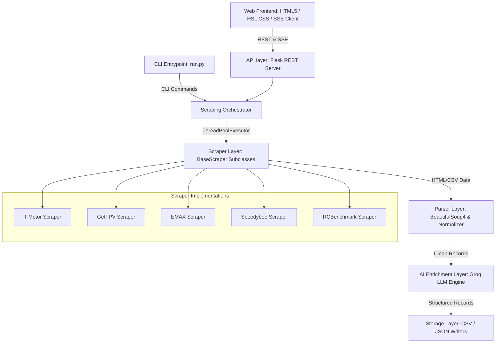

# System Architecture Specification — ThrustVault Scraper

**Document Version**: 1.1.0  
**Target Audience**: Chief Technology Officer, Principal Software Architect, Senior Engineering Staff

---

## 1. Executive Summary & Design Philosophy

The **ThrustVault Scraper** is a high-throughput, resilient intelligence-gathering system designed to harvest, parse, structure, and enrich drone propulsion component specifications and empirical performance curves from across the web.

Propulsion specifications (motors, ESCs, propellers) are scattered across manufacturer websites, retail catalogs, and raw test databases in unstructured formats. The architecture of ThrustVault is optimized to solve three primary engineering challenges:
1. **Resilience to Anti-Bot Measures**: Intercepting and bypassing sophisticated security gates (Cloudflare, Magento firewalls).
2. **Speed & Efficiency**: Leveraging thread-level concurrency for parallel scraper execution, lazy crawling, and intelligent pre-filtering.
3. **Structured Data Extraction (AI-Powered)**: Using high-throughput, low-latency LLMs (Groq Llama 3.3) to normalize unstructured specs into a strict database schema.

---

## 2. Architectural Layers

ThrustVault adopts a layered, component-based architecture to guarantee separation of concerns and ease of extensibility.



### 2.1 Interface Layer (REST & CLI)
* **REST API (`api.py`)**: A multi-threaded Flask application exposing REST endpoints to manage scrape jobs. It implements Server-Sent Events (SSE) to push live status, warnings, and parsed results to the client.
* **CLI Engine (`run.py`)**: A CLI tool that parses execution arguments and controls scraping flows from the terminal.

### 2.2 Orchestrator Layer
Manages the concurrent lifecycle of scraping tasks. It uses python threads to run multiple scrapers concurrently, handles cross-site synchronization, error aggregation, and routes results to the parsing and deduplication pipelines.

### 2.3 Scraper Layer (The Scraper Matrix)
Abstracted by `BaseScraper`. Each scraper targets a specific vendor or retail source:
* **T-Motor (`tmotor_scraper.py`)**: Official manufacturer store crawler. Scrapes detailed HTML specs tables, matching guides, and raw performance curves.
* **GetFPV (`getfpv_scraper.py`)**: Catalog scraper targeting distributor retail listings.
* **EMAX (`emax_scraper.py`)**: Official EMAX Shopify listing crawler.
* **Speedybee (`speedybee_scraper.py`)**: Speedybee store crawler.
* **RCBenchmark (`rcbenchmark_scraper.py`)**: Bench test dataset scraper that downloads and parses raw CSV files.

### 2.4 Parsing & AI Normalization Layer
* **Normalizer (`parsers/motor_parser.py`)**: Rules-based cleaner that extracts units, formats strings, and coerces values (e.g. converting weights to float integers).
* **Deduplication Engine (`utils/dedup.py`)**: Merges redundant data from different websites by comparing normalized names and KV ratings.
* **AI Spec Extractor (`parsers/groq_parser.py`)**: Concurrently dispatches requests to the Groq API (`llama-3.3-70b-versatile`) to extract structured JSON from raw product descriptions.

### 2.5 Storage Layer (`storage/`)
Manages persistence. Formats the aggregated dataset into UTF-8 encoded files (CSV or JSON) with an Excel-compatible Byte Order Mark (BOM).

---

## 3. Concurrency & Performance Model

To optimize performance, the system implements concurrency at both the **macro** (source-level) and **micro** (item-level) tiers.

### 3.1 Macro Concurrency: Parallel Source Execution
Scraping is executed concurrently. When a query is received, the Orchestrator initiates a thread pool:
$$\text{Max Workers} = \text{Count of Active Sources}$$
Each source scraper runs within its own thread context, communicating back to the main Flask event loop via thread-safe queues.

### 3.2 Micro Concurrency: Parallel Crawling
For scrapers requiring detail-page visits (like `tmotor`), the scraper spawns a secondary internal thread pool to fetch detail pages in parallel:
```python
with concurrent.futures.ThreadPoolExecutor(max_workers=max_workers) as executor:
    # Concurrent fetches and parses of detail pages
```
This reduces the time taken to crawl 10 product pages from $10 \times \text{RTT} \approx 20\text{s}$ to a single concurrent round-trip of $\approx 2\text{s}$.

### 3.3 Real-Time Logging (SSE)
Log events, warning states, and success indicators are encapsulated inside standard JSON objects and pushed to the client using Server-Sent Events (SSE). The SSE connection stream is buffered asynchronously (`X-Accel-Buffering: no`), ensuring the user gets instant updates without browser blocking.

---

## 4. Rate Limiting & Stealth Strategy

### 4.1 Per-Domain Rate Limiting
To prevent IP bans, the system routes all HTTP fetches through a per-domain throttle manager (`utils/rate_limiter.py`):
```python
_last_request: dict[str, float] = {}

def wait_for_domain(url: str) -> None:
    domain = urlparse(url).netloc
    last = _last_request.get(domain, 0)
    elapsed = time.time() - last
    delay = random.uniform(REQUEST_DELAY_MIN, REQUEST_DELAY_MAX)
    if elapsed < delay:
        time.sleep(delay - elapsed)
    _last_request[domain] = time.time()
```
* **Performance Defaults**: Optimized to `REQUEST_DELAY_MIN = 0.1s` and `REQUEST_DELAY_MAX = 0.3s` for rapid querying, but fully configurable in `.env` to be more polite for full database dumps.

### 4.2 Multi-Tier Connection Fallback
HTTP requests use a fallback matrix to maximize reliability:

```
[Plain requests (Fastest)] ──(Failure)──> [curl_cffi (Chrome impersonation)]
                                                  │
                                              (Failure)
                                                  ▼
[Playwright-stealth (Full JS Browser)] <──(Failure)── [cloudscraper (CF bypass)]
```

1. **Layer 1: Python `requests`**: Quick, direct HTTP fetch using realistic Chrome headers.
2. **Layer 2: `curl_cffi`**: Performs TLS fingerprint impersonation (JA3 matching chrome-120 signatures), bypassing basic Cloudflare web application firewalls.
3. **Layer 3: `cloudscraper`**: Bypasses standard Cloudflare JavaScript challenges.
4. **Layer 4: `Playwright-stealth`**: Launches a headless Chromium browser with anti-fingerprint stealth plugins. Used as a fail-fast last resort with strict timeouts.

---

## 5. Security & Key Management

* **Environment Separation**: All credentials (e.g. `GROQ_API_KEY`) and network configuration parameters are strictly separated into `.env` (which is git-ignored) and loaded via `dotenv` in `config.py`.
* **Credential Leakage Prevention**: Built-in safeguards in `.gitignore` ensure environment secrets, logs, local caches, and build folders are never committed to repositories.
